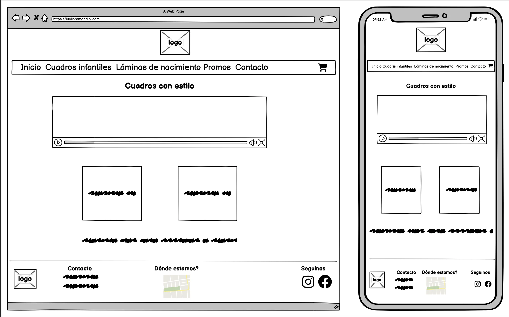
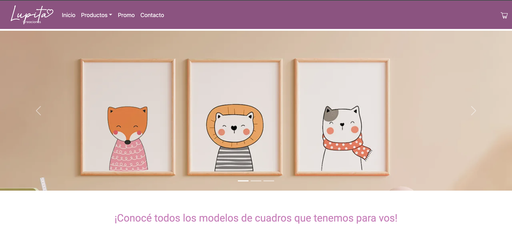
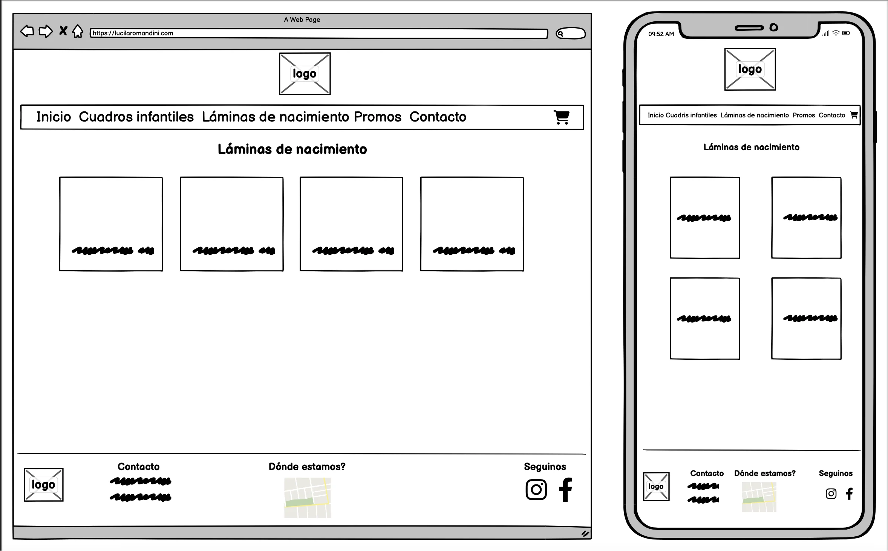
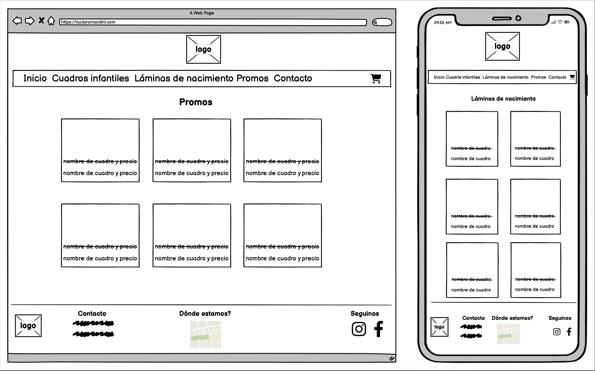
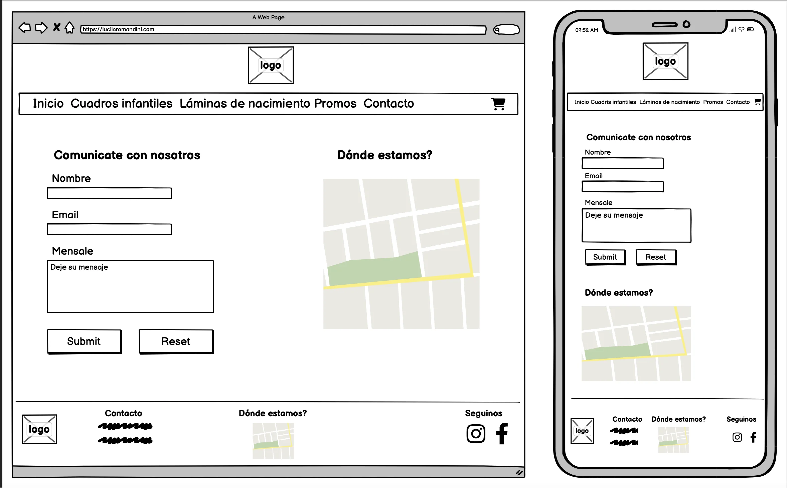

# Lupita creaciones ✨ 💫
## Lupita creaciones: El sitio donde encontrarás los mejores cuadros 
Lupita Creaciones es un sitio dedicado a la decoración de espacios infantiles con los mejores cuadros. Además, ofrecemos cuadros de nacimiento, que son láminas donde puedes plasmar toda la información del bebé y así guardar los mejores recuerdos en un hermoso cuadro. ❤️

## Inicio de mi Sitio web 💻
Cuando diseñé los wireframes, inicialmente creí que eran óptimos y que seguiría ese diseño tal como estaba. Sin embargo, al comenzar con la maquetación, me di cuenta de que había margen para mejoras.

### Index
Como primer wireframe del index, diseñé una versión inicial bastante sencilla, sin mucho estilo o diseño específico. A medida que avanzaba en el curso, comencé a notar áreas de mejora para darle más personalidad a la página. 

Durante el proceso de maquetación, realicé las siguientes modificaciones:

* Agregué accesos directos a los distintos productos.
* Implementé un menú desplegable en la barra de navegación para que los usuarios puedan encontrar fácilmente los productos.
* Incorporé el logo en la barra de navegación.
* Introduje un encabezado con un carrusel de fotos.

Quedando de esta forma

### Productos; Promos y Contacto
En cuanto a la maquetación de productos y promociones, no me alejé mucho de los bocetos originales. En la sección de contacto, me basé en los bocetos originales y realicé una pequeña modificación. Coloqué el contenido en una sola columna, con el mapa ubicado debajo del formulario y proporcioné información de ubicación por escrito

### Footer
En cuanto al footer, se modificó bastante, ya que en los bocetos originales el footer contenía información de contacto, un mapa de ubicación y enlaces a las redes sociales. Tomé la decisión de modificarlo, colocando información sobre medios de pago, opciones de envío, detalles de contacto y enlaces a las redes sociales, ya que esta información no estaba presente en la página. Considero que de esta manera, el footer quedó más armonioso y completo

## Tecnología utilizada 💻 

* HTML5
* CSS3
* Node.js
* SASS
* Bootstrap

## Controlador de versiones 💻

* Git
* Github

## Herramienta de desarrollo 🔧

* Visual    

## Herramienta de desarrollo 

* Netifly

##Instalación ⚙️
El proyecto Lupita creaciones es un sitio web donde podés encontrar los mejores cuadros decorativos infantiles y láminas de nacimiento. Sigue los siguientes pasos para instalar y ejecutar el sitio en tu entorno local:

##Requisitos previos 👾
Asegurate de tener instalado lo siguiente en tu pc:

Node.js
npm (generalmente se instala con Node.js).
##Pasos a seguir ✅
### 1: Clonar el repositorio 📂 
Podés utilizar el siguiente comando "git clone git@github.com:lucilaromandini/lupita-creaciones.git".
### 2: Reinstalar dependencias 🔧
Las dependencias ya se encuentran en el package.json, pero es necesario instalarlas nuevamente con el comando "npm install".

### 3: Iniciar SASS ✨
Tené en cuenta que para trabajar el estilo del proyecto, es necesario que trabajes sobre los partials de SASS.                   
Para iniciar SASS, deberás utilizar el siguiente comando: "npm run sass:watch".

### 4: Codear 🧠
Sentite libre de aplicar modificaciones y llevar el proyecto a distintos horizontes.

### Vínculos a Lupita Creaciones 🖼
https://lupitacreaciones.netlify.app/  
https://lucilaromandini.github.io/lupita-creaciones/  
https://github.com/lucilaromandini/lupita-creaciones

                 

