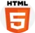

# Lupita creaciones ✨ 💫
## Lupita creaciones: El sitio donde encontrarás los mejores cuadros 
Lupita creaciones se trata de un sitio donde podrás encontrar los mejores cuadros infantiles para decorar los espacios de los mas pequeños, así como también encontrarán cuadros con cuadros de nacimiento, estas se tratan de láminas donde podrás plasmar toda la informació del bebe y así plasmar los mejores recuerdos en un hermoso cuadro.❣️

## Inicio de mi Sitio web 💻
Al realizar los  wireframes creí que eran los optimos y que los iba a seguir tal cual están, pero al comenzar a maquetar me di cuenta que se podía mejorar. 

### Index
Como primer wireframe del index,lo boceté muy sencillo, sin mucho estilo o diseño específico.
A medida que avanzaba en el curso pude notarlo y pensar mejoras para que tenga mas estilo, es por esto que a medida que fuí maquetaba lo fui modificando para darle más personalidad a la página.    
* Agregué accesos diectos a los distintos productos,                                                              
* Agregué a la navbar un menú desplegable, donde pueden encontrar los productos,  
* Coloqué el logo en la navbar,  
* Agregué un header con un carrousel de fotos.

Quedando de esta forma

### Productos; Promos y Contacto
Con lo que respecta de productos y promos no fue maquetado muy lejos de los bocetos, se siguio bastante el estilo pensado desde el principio.
Mientras que en contacto me base en lo bocetado, dàndole una pequeña modificación, coloqué el contenido en una sola columa, quedando el mapa por debajo del formulario, y con información sobre ubicación por escrito.

### Footer
En cuanto al footer se modificó bastanta, ya que en los bocetos originales el footer contenía contacto, mapa de ubicación y las redes.
Se tomó la decición de modificarlo, colocando los medios de pago; envío; contacto y redes ya que esa información no se encontraba en la página y eliminando el mapa de ubicación, ya que esto se puede encontrar en contactos.
Considero que de esta manera quedó con mas armonía y completa.

## Tecnología utilizada 💻 

 
 

## Controlador de versiones 💻

## Herramienta de desarrollo 🔧

    

## Herramienta de desarrollo 
Netifly

##Instalación ⚙️
El proyecto Lupita creaciones es un sitio web donde podés encontrar los mejores cuadros decorativos infantiles y láminas de nacimiento. Sigue los siguientes pasos para instalar y ejecutar el sitio en tu entorno local:

##Requisitos previos 👾
Asegurate de tener instalado lo siguiente en tu pc:

Node.js
npm ( generalmente se instala con Node.js )
##Pasos a seguir ✅
### 1: Clonar el repositorio 📂 
Puedes utilizar el siguiente comando "git clone 
### 2: Reinstalar dependencias 🔧
Las dependencias ya se encuentran en el package.json, pero es necesario instalarlas nuevamente con el comando "npm install".

### 3: Iniciar SASS ✨
Ten en cuenta que para trabajar el estilo del proyecto, es necesario que trabajes sobre los partials de SASS.                   
Para iniciar SASS, deberás utilizar el siguiente comando: "npm run sass:watch".

### 4: Codear 🧠
Siéntete libre de aplicar modificaciones y llevar el proyecto a distintos horizontes.

### Vínculos a Lupita Creaciones 🖼

                 

